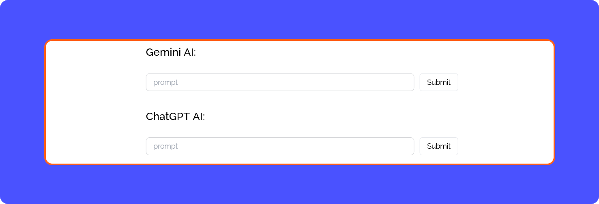

# AI Component

```
Frontend/src/routes/RoutesPath.tsx

import CheckAI from "./protected/exampleAI/CheckAI";
<Route path='/ExampleAI' element={<CheckAI/>} />

Routes for CheckAI Components
Frontend/src/routes/protected/exampleAI
```

*You can use this example as a starting point, but please note that it's a simplified demonstration and should not be used in production as-is. Be sure to add additional validators, security measures, and best practices to ensure a robust and secure implementation.*


