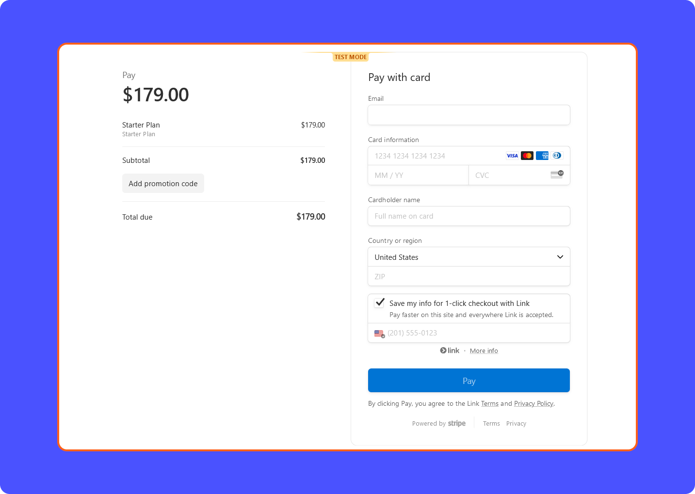

# Payment Component

```
Frontend/src/routes/RoutesPath.tsx

import CheckPayment from "./protected/payment/CheckPayment";
<Route path='/Checkout' element={<CheckPayment />} />

Routes for Checkout Components
Frontend/src/routes/protected/payment
```




Payment SuccessFul

The 'Payment Successful' message will be rendered once a user makes a successful payment, and the path will be `/return?session_id=[stripe generated session]`.

By default, accessing `/return` without a valid `session_id` parameter will return null, as the `session_id` is required.


