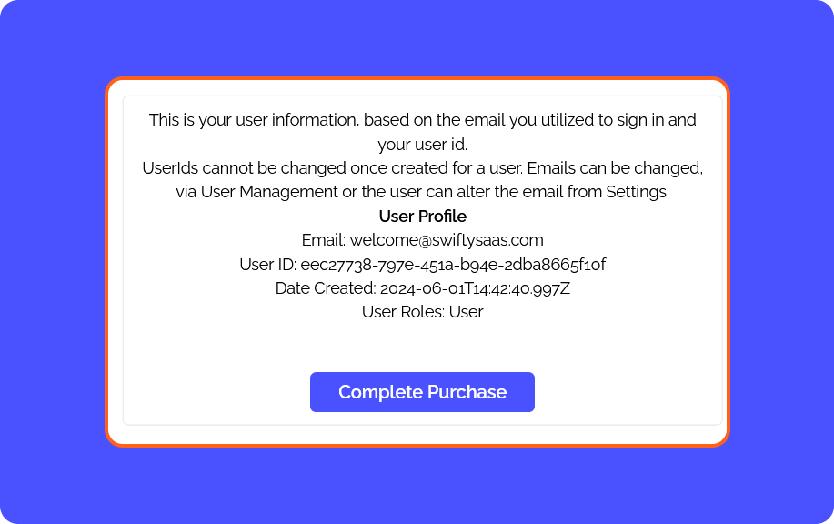

# Profile Component

```
Frontend/src/routes/RoutesPath.tsx

import CheckProfile from "./protected/profile/CheckProfile";
<Route path='/Profile' element={<CheckProfile />} />

Routes for Profile Components
Frontend/src/routes/protected/profile

```

*Once a user signs up, they will see their user information. This is for reference purposes only and should not be used in production. This example is meant to demonstrate how to fetch user data and other information.*


